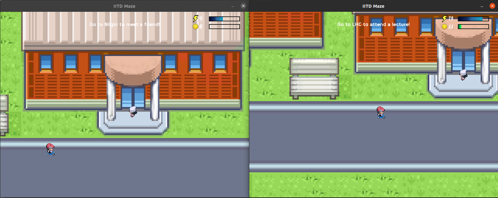
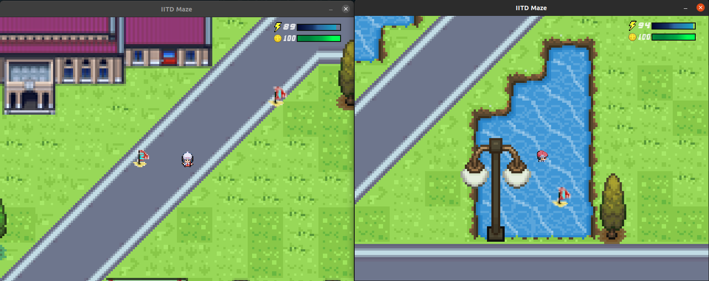
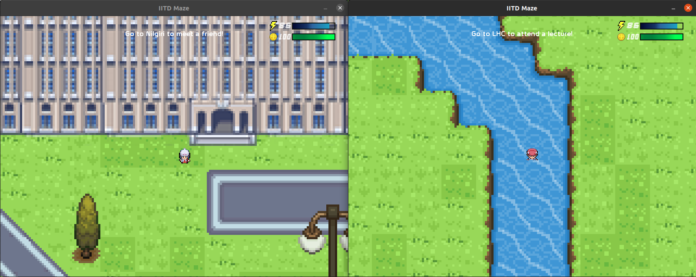

# COP290 Task 2: The IITD Maze
Divyansh Mittal 2020CS10342  
Vaibhav Agarwal 2020CS10447
## About
The game is built using SDL2 library and the game logic is written in C++. ENet is used for networking.
## How to play?
1. Clone the repo.
2. run ```make one``` or ```make two``` based on whatever mode you want to play.
3. run ``` make``` and ```./game.out IP ADDRESS``` to connect to the server.


Currently we have 2 game modes - 
1. Game mode 1 tests you knowledge on how well you know the nooks and crannies of the campus. It is similar to a treasure hunt accross the campus. You will be given 2 hints and you objective is to place 2 flags as close to the correct location possible. The one who overall places the flags closer wins !.

2. Game mode 2 is a time based mode. The one who is faster wins. You have 3 objectives and your goal is to complete them as fast as possible. The one who gets them done first is declared the winner.

Check out the pdf for detailed instructions.

## Glimpses of our game






## Instructions to install SDL2 and other libraries
1. Run `sudo apt-get install libsdl2-dev` to install SDL2.
2. In order to run the game successfully, the following extra libraries are needed: SDL_image, SDL_ttf and SDL_mixer.

    - Install SDL_image using `sudo apt-get install libsdl2-image-dev`.

    - Install SDL_ttf using `sudo apt-get install libsdl2-ttf-dev`.
    - Install SDL_mixer using `sudo apt-get install libsdl2-mixer-dev`.

*The instructions mentioned above for various installations were used on Ubuntu 20.04.*

## Acknowledgements 
1. Pyxel Edit Software  
2.  https://www.youtube.com/playlist?list=PLhfAbcv9cehhkG7ZQK0nfIGJC_C-wSLrx  
3. https://github.com/zpl-c/enet  
4. https://www.libsdl.org/  
5. https://in.pinterest.com/  
6. https://www.deviantart.com/davian-art  
7. https://opengameart.org/  
